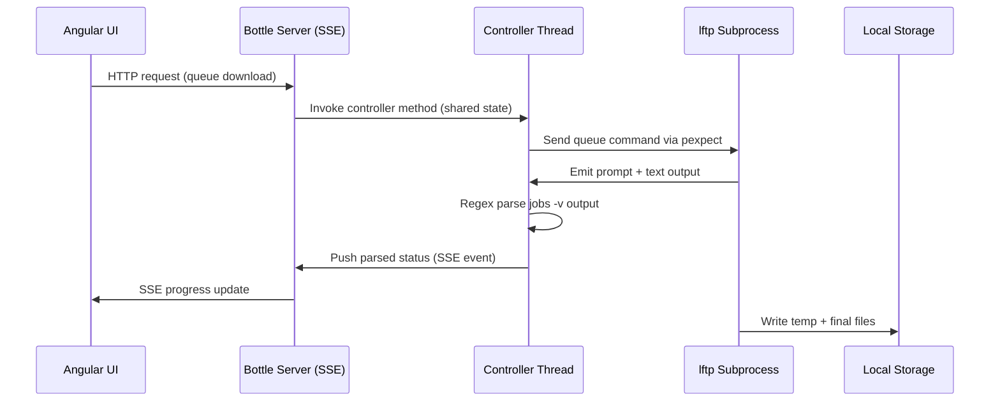
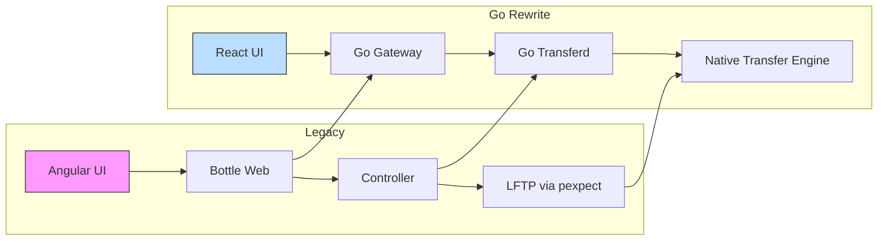

# Legacy SeedSync Architecture Overview

This document visualizes the current Python/LFTP-based SeedSync architecture and highlights the components that the Go rewrite will replace. The diagrams use Mermaid notation so they can be rendered directly by many Markdown viewers.

## 1. High-level system topology

```mermaid
graph LR
    subgraph Client
        UI[Angular 4 SPA]
    end

    subgraph SeedSyncHost
        Web[Python Bottle Web Server]
        Controller[Controller Thread]
        Lftp[LFTP Wrapper (pexpect)]
        Scan[Scanner Threads]
        SSH[SSH/SCP Helpers]
    end

    Remote[Remote Seedbox]
    Local[Local Download Storage]

    UI -- SSE/REST --> Web
    Web -- Shared Memory --> Controller
    Controller -- Commands --> Lftp
    Controller -- Job Updates --> Web
    Controller -- Scan Jobs --> Scan
    Scan -- SSH/SCP --> Remote
    Scan -- File Ops --> Local
    Lftp -- SFTP/FTP --> Remote
    Lftp -- File Writes --> Local
```

**Replacements in the Go migration**
- `UI` → React + TypeScript client served by the Go gateway.
- `Web` → Go API gateway (gRPC + REST + realtime streams).
- `Controller`/`Lftp` → Go transfer orchestrator and eventual native transfer engine.
- `Scan`/`SSH` → Go-based scanner services leveraging the new async transfer layer.

## 2. Legacy controller interaction flow



**Pain points addressed by the Go rewrite**
- Tight coupling between `Web` and `Ctrl` via shared memory → replaced with gRPC contracts.
- Fragile `pexpect` parsing of `lftp` output → first hardened supervisor, then native Go transfer engine.
- SSE stream limitations → realtime gRPC-Web/WebSocket streams with resumable cursors.

## 3. Component replacement matrix

| Legacy component | Location | Responsibility | Go replacement |
| --- | --- | --- | --- |
| Angular 4 SPA | `src/angular/` | Dashboard UI, progress rendering via SSE | React + TypeScript app in `webapp/`, consuming gRPC-Web streams |
| Bottle web server | `src/python/web/` | REST endpoints, SSE, static serving | Go API gateway (`services/gateway`) |
| Controller | `src/python/controller/controller.py` | Queue management, LFTP orchestration | Go transfer daemon (`services/transferd`) |
| LFTP wrapper | `src/python/lftp/` | Interactive `lftp` session via `pexpect` | Phase 1: Go LFTP supervisor; Phase 2: native Go transfer engine |
| Scanner threads | `src/python/controller/scan/` | Local/remote filesystem discovery | Go scanner services (`services/scanners`) |
| SSH helpers | `src/python/ssh/` | SSH, SCP, rsync utilities | Consolidated into Go async transfer/scan packages |
| SSE event stream | `src/python/web/` | Live updates to UI | gRPC-Web/WebSocket streaming layer |

## 4. Runtime deployment view

```mermaid
graph TD
    subgraph Process: seedsync.py
        Bottle[Bottle Web Server]
        Ctrl[Controller]
        Workers[Worker Threads]
    end

    Bottle -->|SSE| Client[Angular Browser]
    Ctrl -->|pexpect| LftpProc[/usr/bin/lftp]
    Workers -->|Filesystem| LocalDisk[(Local Storage)]
    LftpProc -->|Network| RemoteSeedbox
```

During migration, the monolithic `seedsync.py` process will be replaced by multiple Go binaries (gateway, transfer daemon, scanner services) managed under Bazel, each exposing gRPC contracts that the React client consumes through the realtime communication layer.

## 5. Data/control flow alignment with Go rewrite



This flowchart emphasizes the one-to-one mapping between major legacy components and the Go services replacing them. Early milestones keep `D` (LFTP) alive via the hardened supervisor, while later milestones deliver `D2` (native transfer engine) for improved performance and reliability.

---

*Use these diagrams alongside `doc/go_migration_repo_setup.md` and milestone plans to stay oriented as you port functionality from the legacy Python/LFTP architecture to the new Go/Bazel stack.*
